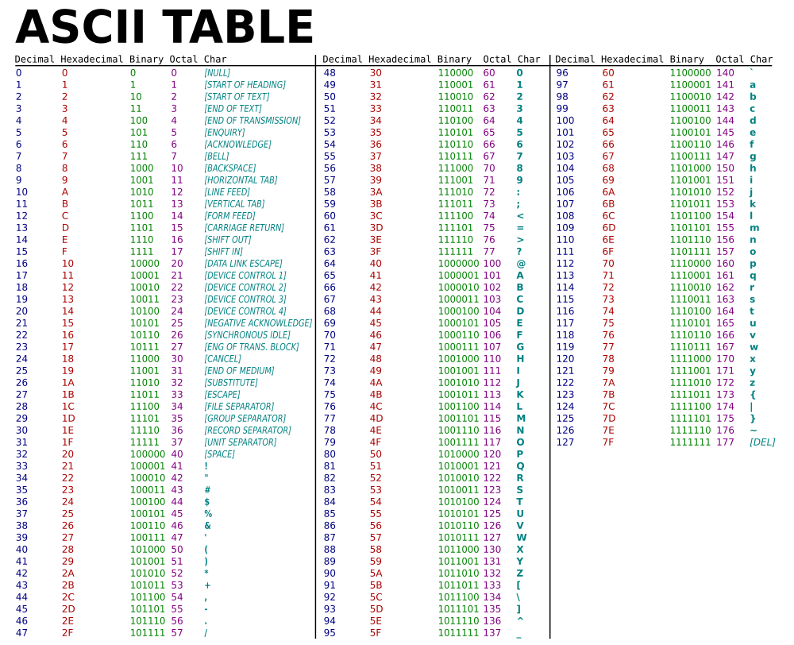

###### 75.41 95.15 95.12 CB100 Algoritmos y Programación II Curso 4
# TP0 - Split

# Introducción

Al trabajar con texto, separar cadenas de caracteres por un delimitadores una de las operaciones mas comunes. El lenguaje de programación **C** no cuenta con esta primitiva para el manejo de strings y por lo tantovamos a tener que implementarla nosotros mismos. El objetivo de estetrabajo optativo es introducirnos en el mundo del manejo de la memoriadinámica en **C** y de paso servir como repaso de algoritmia básica dela materia anterior. El código elaborado en este TP optativo será deutilidad al elaborar el próximo TP.

# Cadenas de caracteres en C

**C** no cuenta con una primitiva para representar cadenas de caracteres(strings). Para representar strings en **C** se utilizan vectores detipo **char** y una convención. La convención indica que los stringsfinalizan con un caracter de valor 0. Esto significa que en **C**,cualquier secuencia de bytes terminada con un valor 0 puede tomarse comoun string. Recordemos algunos conceptos básicos antes de seguir avanzando.

## Tipos de dato

**C**, a diferencia de los lenguajes de **tipado** dinámico, poseeverificación estricta de tipos. Esto implica que cada variable utilizadadebe declarar un tipo. El tipo declarado nos indica qué rango y tipo devalores se pueden almacenar en dicha variable. Los tipos básicos queprovee **C** son:

-   **char**: 1 byte, almacena valores numéricos enteros de 0 a 255
-   **int**: Generalmente 4 bytes. Almacena valores numéricos enteros entre **INT_MIN** e **INT_MAX**.
-   **float** y **double**: 4 y 8 bytes respectivamente. Almacenan valores numéricos en punto flotante (reales).

Además de estos tipos básicos existen modificadores que pueden afectarlos rangos numéricos que pueden ser almacenados. Por ejemplo existe elmodificador **unsigned**, que no permite que los valores almacenadossean negativos. Entonces, a partir de estos tipos básicos y utilizandomodificadores se puede lograr una gran variedad de tipos diferentes.

## Arrays

Los **arrays** (que muchas veces solemos llamar **vectores**), soncolecciones de elementos del mismo tipo. Por ejemplo, tener una variablede tipo **array de enteros** de tamaño 10 significa que la variablepuede almacenar 10 **int**. Estos 10 enteros pueden ser accedidosdirectamente mediante un subíndice y adicionalmente se encuentranacomodados secuencialmente en la memoria (uno al lado del otro, sinespacios de por medio).

``` c
//Declaro una variable diez_enteros que puede almacenar 10 ints
int diez_enteros[10];

//asigno el valor 999 al primer entero del array
diez_enteros[0] = 999;

//asigno el valor -534 al último entero del array
diez_enteros[9] = -534;
```

## Texto y tabla ASCII

Como se puede observar, sólo hablamos de tipos de dato que almacenanvalores numéricos. ¿Cómo representamos caracteres y texto? Si asignamosun número a cada letra del abecedario, podríamos utilizar los tipos dedatos que tenemos disponibles para representar texto. Para lograr queesto funcione, claro, hayq que ponerse de acuerdo en nua convención dequé número corresponde a cada letra. Esta convención existe y la podemosver reflejade en la tabla **ASCII**, que en definitiva es una tabla quenos permite conocer la equivalencia entre un número y el caracter querepresenta.



Entonces por ejemplo, la tabla nos dice que para representar el caracter'@' se usa el valor 64 y que el valor 99 representa la 'c' minúscula.Los valores de 0 a 31 y el 127 son especiales y se conocen como**caracteres de control** y se utilizan para representar diferentescosas. Por ejemplo el caracter 10 o 0x0A (representación hexadecimal), o\\n (código especial de escape reconocido por **C**) representa un finalde línea en sistemas tipo **Unix**. En particular el valor 0 es el queutilizamos como convención para marcar el final de un string.

En definitiva esta es la forma básica de almacenar texto en unacomputadora bajo el estándar **ASCII** (que no es el único pero sí elmas extendido). La representación **UTF8** por ejemplo es compatible con**ASCII** y utiliza los mismos primeros 128 códigos, pero luego utilizamúltiples bytes (de 2 a 4) para representar el resto de los caracteres o **codepoints**. La idea siempre es la misma. Los caracteres de texto sonrepresentados mediante valores numéricos. Cuando se trabaje con texto seestá trabajando, a bajo nivel, con números.

## Por fin strings

Volviendo un poco al principio, los strings no son mas que una colecciónde bytes (char) delimitado por un valor 0 (no confundir 0, a vecesrepresentado en el código como \\0) con el caracter '0', que correspondeal valor 48. Entonces, aplicando los conocimientos que acabamos derepasar, podemos representar un string de forma básica en **C** haciendolo siguiente:

``` c
//declaro un array de 100 bytes
char mi_texto[100];

//Asigno caracteres a cada posición
//Notar que es posible usar la sintaxis de caracter con las comillas simples, tanto
//como utilizar los números directamente (aunque siempre que se pueda se recomienda
//utilizar la notación de caracteres, para que sea mas claro)
mi_texto[0] = 'H';
mi_texto[1] = 'o';
mi_texto[2] = 'l';
mi_texto[3] = 97; //97 es 'a'

//Hasta este punto, mi_texto no puede ser considerado un string, y no debe ser
//pasado a funciones que esperan un string, ya que no posee el 0 al final,
//y por lo tanto no es posible conocer dónde finaliza dicho string

//La siguiente operación es indefinida, y seguramente cause problemas de memoria
//ya que %s espera un string para mostrar por pantalla, pero mi_texto no lo es.
printf("%s", mi_texto);

mi_texto[4] = 0;
//A partir de este momento, mi_texto puede ser considerado un string.

//Esta otra sintáxis para definir strings utiliza punteros (no es tema de este repaso).
//Define un string otro_texto con el contenido "Hola". En este caso no es necesario
//poner el 0 explícitamente, ya que el compilador lo pone automáticamente.
//Como contrapartida, este string es estático, se encuentra en una zona de sólo
//lectura y no debe ser modificado (a menos que se quiera tener errores de memoria)
char* otro_texto = "Hola";
```

# ¿Y qué hacemos con todo esto?

**C99** (el estándar de **C** utilizado en la materia) cuenta condiferentes primitivas para trabajar con strings (como **strcpy**,**strcmp**, **strcat**, **strstr**, etc), pero no cuenta con una primitiva que reciba un string y un delimitador y devuelva un vector conlos strings delimitados. Entonces la misión, si desean aceptarla (si, es un TP optativo), es implementar esta primitiva (**split**) utilizando memoria dinámica.

## ¿Y cómo lo hacemos?

Básicamente hay que completar el archivo **split.c** con laimplementación del algoritmo pedido. Tengan en cuenta los siguientesitems:

-   No se pueden asumir tamaños máximos: No vale decir 'Asumo que nunca me van a mandar un string mas grande que 5000 caracteres'. No. Usen memoria dinámica, que para eso está.
-   Dicho esto, no todo en la vida es memoria dinámica. Úsenla dónde sea apropiado. El stack sirve para colocar variables locales, úsenlo.
-   Modularización ante todo. No es tan importante en este punto si recorren dos veces el vector para resolver el problema. Es preferible hacer código claro que recorra dos veces el string a un código inentendible que recorre una sola vez.
-   Tienen un **Makefile** que corre pruebas automatizadas para saber si su implementación cumple con lo básico que se pide. Aprovechenlo. Pueden agregar mas pruebas si lo creen necesario.
-   La modularización es importante (¿Ya lo había dicho?). No me hagan un choclo.
-   Los nombres de variable son importantes. Mejor **'int cantidad_de_substrings'** a **'int n'** (pero si, hay casos donde **'n'** es mejor)
-   Los nombres de función también son importantes. Mejor **'buscar_posición_separador'** que **'buscar'**.

